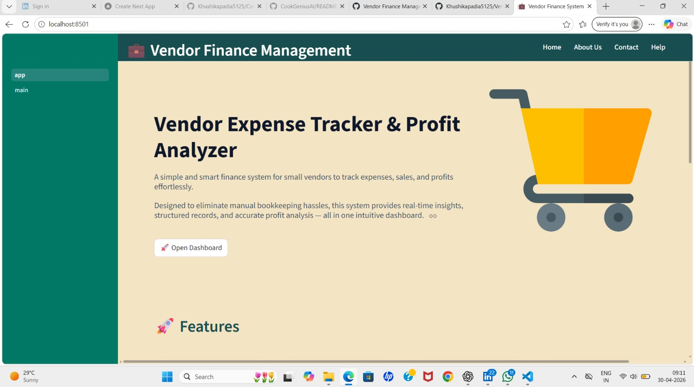
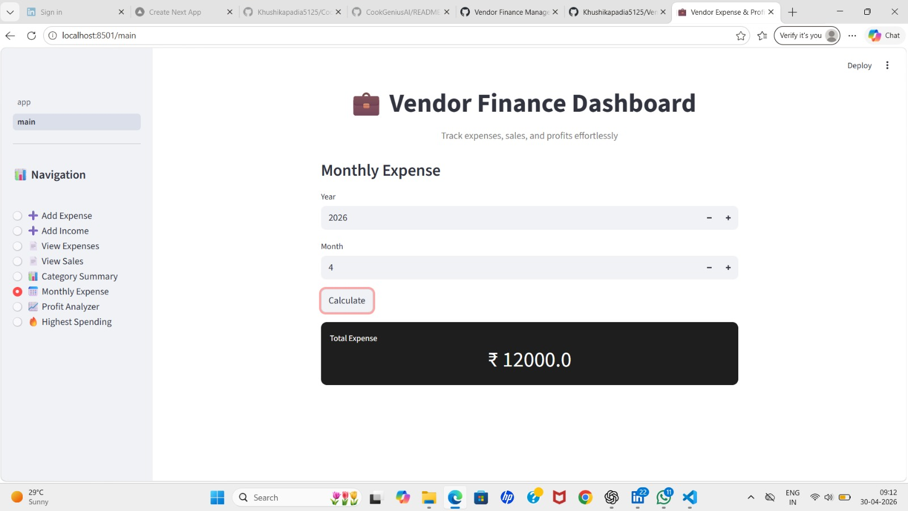

# 💼 Vendor Finance Management System

## 📌 Overview
A full-stack finance management system designed for vendors to track expenses, manage income, and analyze profits efficiently. The system provides real-time insights through an interactive dashboard.

## 🚀 Features
- Expense tracking with categories
- Income (sales) tracking
- Daily, monthly, and yearly profit analysis
- Category-wise expense insights
- Highest spending category detection
- Interactive dashboard using Streamlit

## 🛠 Tech Stack
- Python
- Streamlit
- MySQL
- SQL

## 📊 Key Functionalities
- Add and manage expenses
- Record income transactions
- Generate financial reports
- Analyze profit trends
- Identify high-cost areas

## ▶️ How to Run
1. Install dependencies:
   pip install streamlit mysql-connector-python

2. Setup MySQL database:
   Create database: vendor_expense_tracker

3. Run the app:
   streamlit run app.py

## 📸 Screenshots

### 🏠 Home Page

### 📊 Dashboard & Analysis

## 🎯 Use Case
Designed for small vendors and businesses to replace manual bookkeeping with a digital, automated system.
